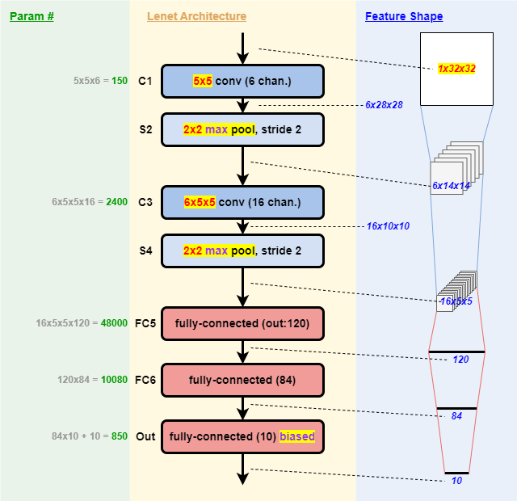

# README
This is the repository of project in the course (VLSI_System_Design - CS5120, 2022 Spring, NTHU)

In this project, I quantized a LeNet into 18-bit for the partial sums, and implemented the hardware engine with verilog.

## Model Architecture (Algorithm)
This is a Modified Lenet Model.

## LeNet Engine Architecture

## Optimization Result
|   Optimization   |   Area   |   Clock Period   |
| ---------------- | -------- | ---------------- |
| 32-bit partial-sum | 416650.59 | 19.3 |
| 18-bit partial-sum | 289875.18 | 19.3 |
| 18b, shared requant circuit | 257310.56 | 19.3 |
| 18b, small requant multiplier | 233470.58 | 13.9 |
| 18b, 40MAC --> 40MUL + ACC | 180445.50 | 13.8 |
