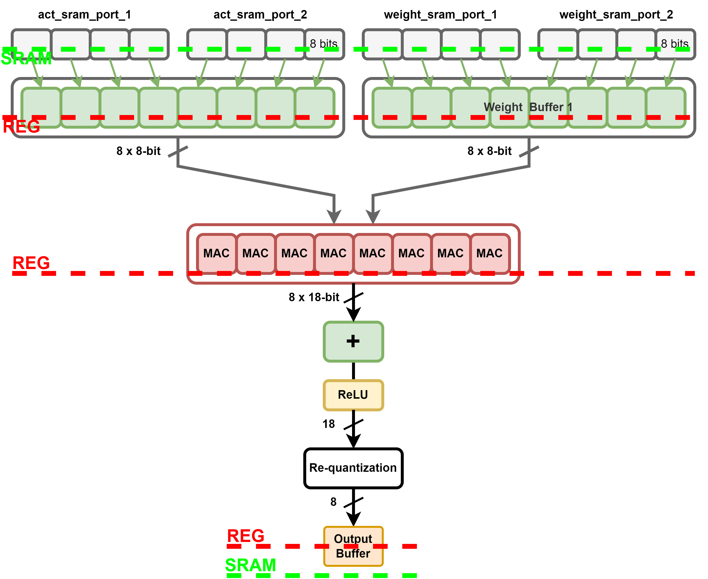
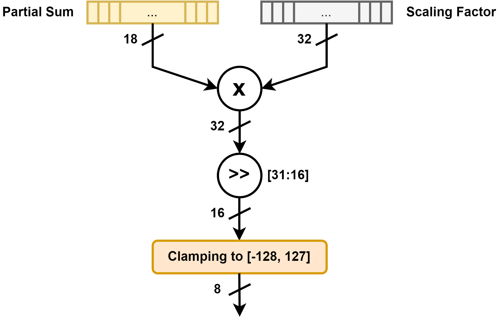

# README
This is the repository of project in the course (VLSI_System_Design - CS5120, 2022 Spring, NTHU)

In this project, I quantized a LeNet into 18-bit for the partial sums, and implemented the hardware engine with verilog.

## Model Architecture (Algorithm)
This is a modified Lenet-5 CNN model. I designed the dataflow by utilizing the 5x5 dimension of the two convolution layers and the 2x2 dimension of the following pooling layers, which can fetch and process the data effectively without repeating.

  

.drawio.png)

.drawio.png)

## LeNet Engine Architecture

## Optimization Result
|   Optimization   |   Area   |   Clock Period   |
| ---------------- | -------- | ---------------- |
| 32-bit partial-sum | 416650.59 | 19.3 |
| 18-bit partial-sum | 289875.18 | 19.3 |
| 18b, shared requant circuit | 257310.56 | 19.3 |
| 18b, small requant multiplier | 233470.58 | 13.9 |
| 18b, 40MAC --> 40MUL + ACC | 180445.50 | 13.8 |
