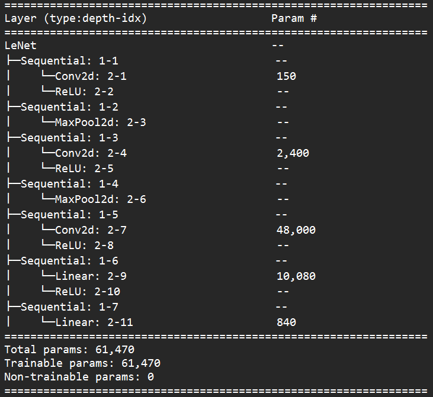

# README
This is the repository of project in the course (VLSI_System_Design - CS5120, 2022 Spring, NTHU)

In this project, I quantized a LeNet into 18-bit for the partial sums, and implemented the hardware engine with verilog.

## Model Architecture
This is a Modified Lenet Model.

